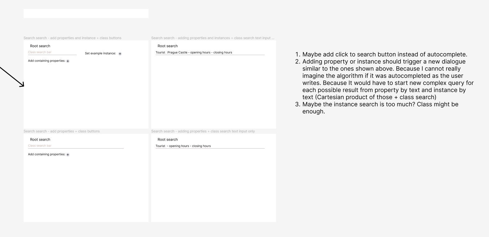
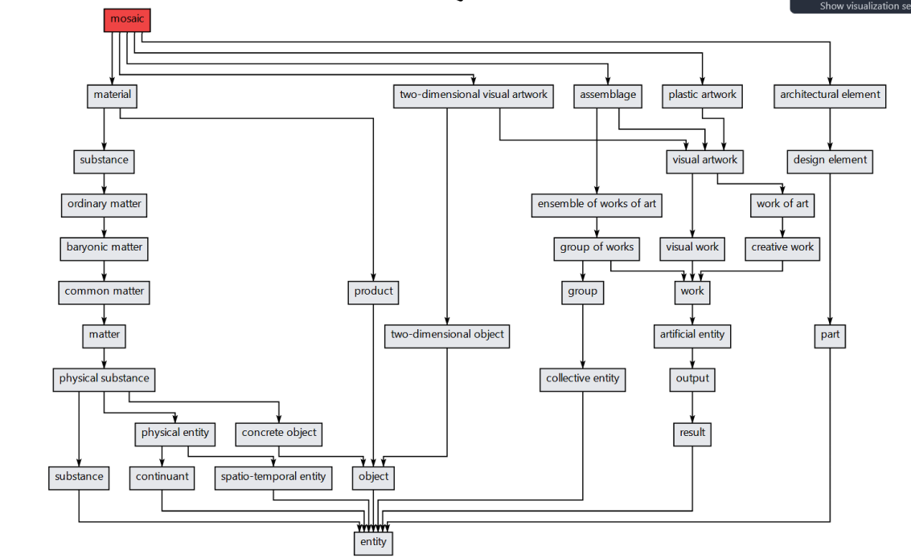
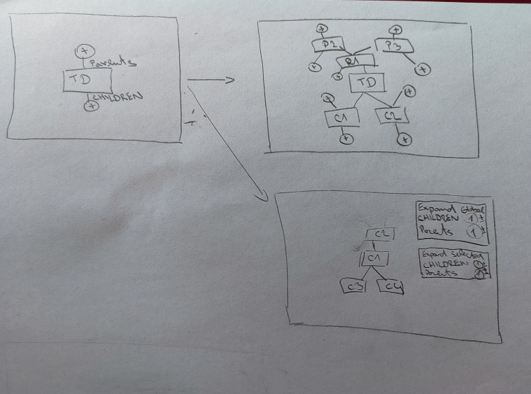
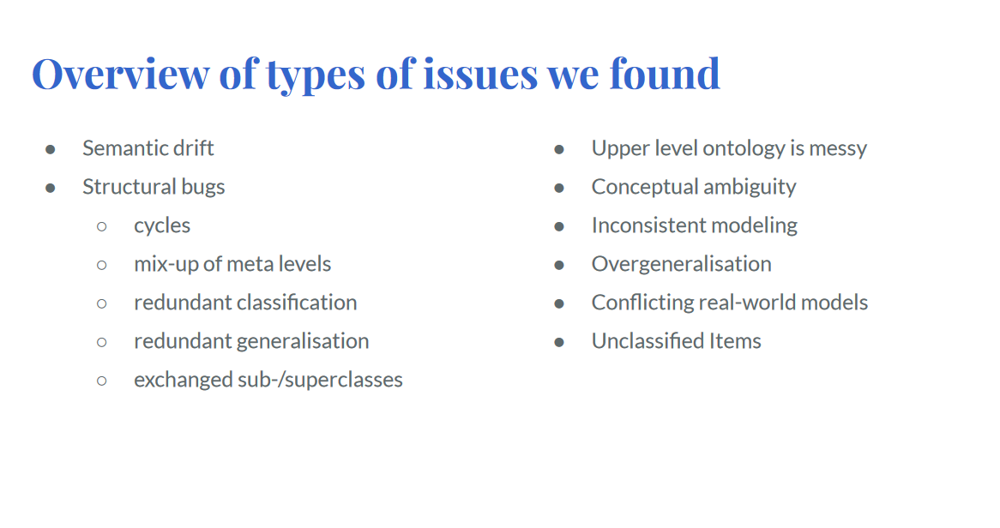
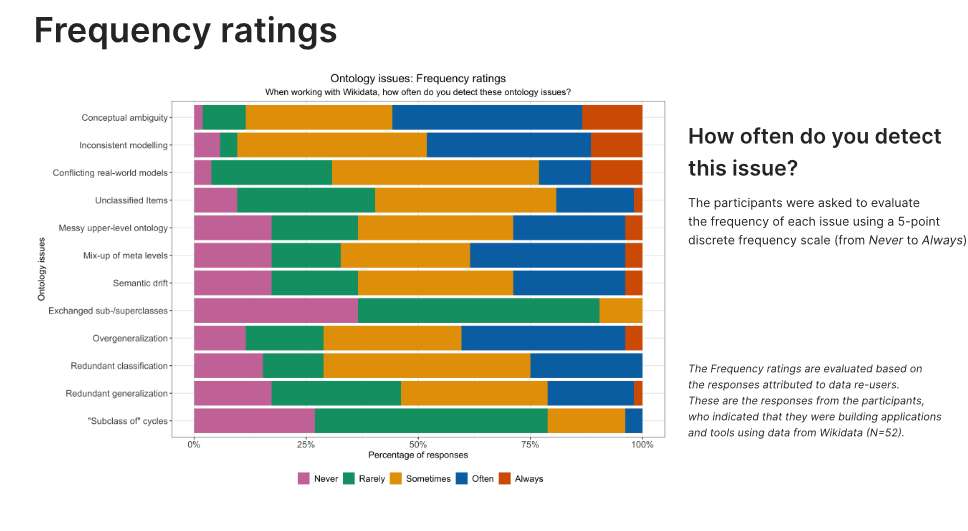
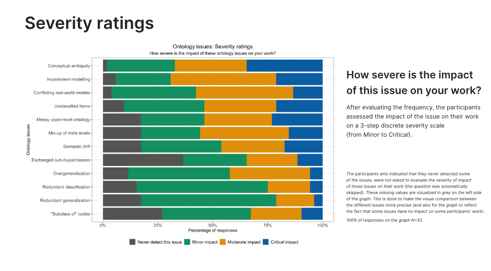

# Topics ideas

- Three main areas:
    1. Ted pracuji s Wikidaty a resim urcite problemy, ale nemam moznost jit v zadnem problemu do hloubky. Hlavni myslenka je zde nejak vybrat veci z toho na cem pracuji a bud jit v jednom smeru do hloubky, nebo jich vzit vicero a jit vic do sirky.
    2. Na necem pracuji, pojdme se na to podivat jeste jinak. 
       - ? Tady si nejsem jisty, vim ze necasky zminil 3 temata a to prostredni jsem zapomnel nez jsem dosel domu.
    3. Pojdme zkusit co jsme ted delali na jine Ontologii.

### First area 

1. Vyhledavaci dialog korene:
   - Na zacatku jsem hodne premyslel nad vyhledavacim dialogu korene v dataspeceru. 
   - Bylo by zajimave podivat se, jak lze lepe hledat na zaklade pozadavku uzivatele -> spojit hledani trid skrze instance a properties. 
   - Napriklad, uzivatel zada vycet properties, ktere chce aby trida mohla mit, k tomu muze zadat priklad instance, aby toho nebylo malo, tak jeste prida nazev tridy. Otazka je zde, jak semanticky hledat dle takove informace? Bude se muset nejak prochazet strom hierarchie, hledat spolecne potomky, predky a nejnissiho/nejvyssiho spolecneho potomka a mezitim drzet v pameti properties, ktere chce a jeste do toho pridat nejake doporucovani. 

    1. muze to mit mnoho podob - podivat se na nejakou tezsi metodu nebo vzit vicero jednodussich?
    2. jak vlastne menit api toho hledani? melo by to mit svuj Query language? Ale to by se uzivatel musel naucit pouzivat. Takze mozna co nejjednodussi UI. Uz samo navrhnout Query pro neco takoveho by bylo hard, jak se vlastne clovek dotaze a vcem ty data budou lezet.
    3. Jak vyhodnotit co vlastne je pro nas good a co ne? Jak zhodnotit tu metodu.
    4. Bavili jsme se o castech:
       1. napriklad podivat se na cetnosti vyuziti instanci
       2. udelat dvoji index jeden upper and jeden lower neco jako v yagu
       3. udelat to co mam vyse
       4. vyhledavat na zaklade uz svych vytvorenych veci v datovych specifikacich
       5. podivat se na tu stranku kterou mi daval necasky - o termech jazyku
   5. Jak vybrat working pro papery?
      1. Searching ontologies, ontology mappings/matchings, concept search in other ontologies
   6. Po rozmluve s Necaskym?
      1. rozmyslet zda zustat u dataspeceru nebo ne
      2. co to ma vlastne delat? omezit se na urovni vyberu korene pri tvorbe nove specifikace
      3. dulezite proc to vlastne delame - chci datovou strukuru na zaklade wikidat
      4. uzivatelsky privetive hledani trid ve wikidatech
      5. krystof ma podobne veci - uzivatelske rozhrani, krystog ma podobne veci, zorehledneni onotlogii, usnadneni uzivatele vyzbat se ve wikidatech, podivat se na hledani konceptu v jine ontologii

1. **TOHLE NE** - Paralelni pipeline:
   - Vytvoreni pipeliny na praci s Wikidaty obecne - a rovnou paralelne. 
   - Mam pipeline, ktera extrahuje nejake tridy v pythonu a provadi nejake male upravy dat. Bylo by fajn napsat nejakou knihovnu, ktera by poskytla rozhrani pro definici akci/filtru, ktere se maji stat na jednotlivych entitach behem pruchodu -> takze Linked Pipes jen pro Wikidata. 
   - Fajn napriklad pro Python a multiprocessing na vice souborech, aby si clovek mohl jednoduse definovat veci, ktere potrebuje.

2. **TOHLE NE** Detailni/analyza pohled na properties:
   - Nejcasteji se ve Wikidatech resi tridy a hierarchie pomoci propert "subclass of" a "instance of". Ale zatim jsem asi nevidel nekoho resit associace na tridach. Napriklad, jak ovlivnuji ontologii obecne, hierarchii trid, prozkoumat vic constraints a vyuziti/pouziti properties.
     - Idealne to zasadit do kontextu Dataspeceru pro vytvareni datovych struktur a jak ovlivni constraints tvorbu nebo jak vsechny constraints vubec zahrnout do Dataspeceru -> qualifiers, conflicts with, atd... 
    - Bylo  by to uzitecne? Prinese to neco noveho? Proc vlastne zatim nikdo moc neresil associace pro tridy? Mame totiz uz constraints a uz se nejak provadi validace na itemech pomoci botů. Co vic na nich vykoukat?
   
   1. Integrovani doporucovani properties na zaklade constraints a rozsireni doporuceni napriklad pro interni veci - vsechno v kontextu dataspeceru
     
3. **TOHLE NE** - Uzivatelske rozhrani pro prochazeni ontologie Wikidata:
   - Udelat nejake cool uzivatelske rozhrani pro prochazeni wikidati ontologie -> ale ja moc uzivatelske rozhrani nechci resit, kdyz jsem videl Adama. Ale porad je to validni napad. 
   - Nebylo by to jen pro tridy, alle hlavne by tam slo o zobrazeni vetsi casti grafu a prochazeni grafu pomoci properties na tridach, coz jsem zatim jeste vubec nevidel.
   - Treba by se tam lehko hledaly cykly.

1. **TOHLE NE** - Algorithmic issues:
   - Napadaji me algoritmicke reseni problemu s ontologii, ktere si nejak nastinili ve Wikidatech.
     1. [ontology issues](https://www.wikidata.org/wiki/File:WikidataCon_2021_-_Overview_of_ontology_issues.pdf)
     2. [ontology suggestions](https://www.wikidata.org/wiki/File:Wikidata_ontology_issues_%E2%80%94_suggestions_for_prioritisation_2023.pdf)
   - Na druhou stranu, prijde mi, ze to je ohrana pisnicka -> treba najdi cyckly v hierarchii, overgeneralization, redundant-xy. Navic jsem uz videl diplomku ze zahranici, kde to nekdo resil, ale v te dobe wikidata mely tak mozna 1/12 dnesni velikosti. Navic ten software uz neexistuje.
   - Pak tam jsou ty semanticke problemy, ale prijde mi, ze resenim je udelat to nejak rucne -> sednout si a rict ze ty koncepty jsou spatne a upravit to -> to by musela delat nejaka AI.

## Second area

1. **TOHLE NE** - Quality assessment: 
   - Napada me zde analyza kvality -> ale spis by bylo uzitecne pro komunitu Wikidat vzit si nejaky jeji issue a vyresit ho. Viz to nahore.

2. **TOHLE NE** - Class grouping and reduction:
   - Pan Necasky zminil, na muj podmet, ze ve Wikidatech je spousta trid, ktere nemaji potomky a nenesou uplne semanticky prinosnou informaci. Napriklad podtridy chemickych prvku.
   - Co se stane, kdyz aplikujeme to shlukovani trid? Vznikne neco lepsiho?
   - Udajne neco takoveho dela Yago.   

## Third area

1. **TOHLE NE** - Integrovat Yago nebo DBPedii:
   - Ale bylo by to dostatecne velke pro DP? 
     - Protoze DBPedia a Yago maji byt vic jako Schema.org, tj. jsou vic ciste a nenesou tolik problemu jako Wikidata. Jaky by v tom byl vlastne research potencial?
   - Zde me napada jen porovnani pruchodu tou integraci do Dataspeceru a popsat nejake hlavni rozdily a problemy:
     - Zde by mozna bylo fajn vzit Yago, protoze Yago castecne vychazi z Wikida.
     -  Wikidata jsou bad a Yago ma byt lepsi, ale jak se to prokaze v prostredi Dataspeceru?
     - U toho yaga jsem koukal na jejich posledni clanek o Yago 4.5, kde extrahuji vetsi cast z Wikidati ontologie. Obecne u toho Yaga maji upper ontology a lower ontology -> upper ontology je nejaka rucne mapovana ze schema org a lower level je z wikidati ontologie. Zatim to vypadalo tak, ze nejak rucne neco zmapovali a pak to automaciky extrahovali/propojili. V tom Yagu 4.5 nejdriv vytvorili tu upper level ontology, a pak vytvorili mapovani z te upper level do Wikidat. Nasledne udelali "shluky" trid z Wikidat, ze pod classu z upper ontology prilepili cely podstrom z wikidat. Ma to pridat vice informaci. Viz paper na jijich strankach.
     - Tim zpusobem vlastne resi problem Wikidat:
       - Wikidata maji messy upper level ontology
       - Ale schema org nema dostatek informaci pro tu lower level ontology, takze je hodne obecna a neda se v ni vicist slozitejsi informace.
       - Takze to vlastne propojili a mame Yago.
   - Na druhou stranu, prijde mi, ze vlastne si ty problemy resi nejak po svem -> skoro vsechny, ktere jsem ve wikidatech videl, nevim jak bych s tim pokrocil na DP, kdybych je porovnaval.