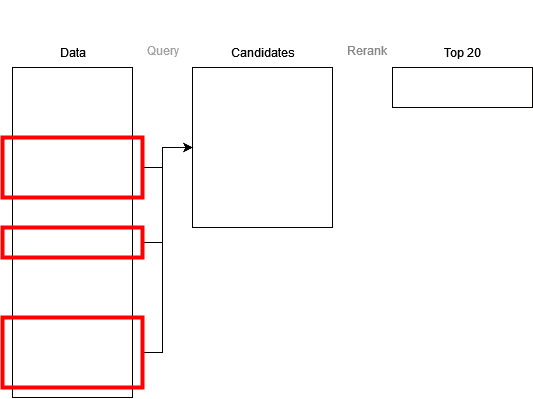

# 3. meeting

This meeting I would like to talk about:
1. Brief overview of what I did.    
2. LLM for query expansion.
   1. could properties filter be search as you type? 
3. Engine overview
   1. where does database fits 

## Brief overview of what I did

- From previous meeting:
  - [x] 1. Try few examples for query expansion.
  - [ ] 2. Think about solutions based on the property selection filtering. (Ongoing)
  - [x] 3. Engine overview


## LLM for query expansion.

- I tried few examples, it was able to do something beneficial
  - Creating a short description for a keyword.
    - A user would have to choose which meaning if the llm is not sure.
  - Creating additional keywords from keywords.

```
Example query:

Concept input bar:
    [ name ], [ short description ]

Properties input bar
    [ name ], [ short description ]
    [ name ], [ short description ]
    ...
```

- Problem I am not sure how to include it.
  - generate a name for a concept based on a description
  - generate description based on a concept name
  - generate properties for a concept name with description
  - generate additional keywords for the entity document
    - has characteristics
    - part of/has parts
    - has cause
    - studied in

### Could properties input bar be search as you type?

- We have ~ 11k properties
- Instead of relying on similarity while searching
- A user could type names/description of properties and select a real wikidata property
- The I would do a concept search while already knowing the properties

## Engine overview



- **Problem with Search engines**
  - Full-text (ElasticSearch, Typesearch, MeiliSearch, ...) 
    - return only the top based on text score (e.g. max 16k)
  - Vector
    - iterative process a-nn given parameter top-k
  
- **We do not have the entire result set**


- Questions
  - Is it okey to use the engines for candidate selection?
  - Or should I opt for entirely my implementation?
    - Needs thread paralelism (java, c sharp).
    - I could not find a good full text search engine with capabilities of above mentioned returning all matched results.
    - Vector similarity in brute force manner - query cos_sim to every entity.


## Final Comments

- I can use the engine for candidate selection.
- Think more about the embeddings.