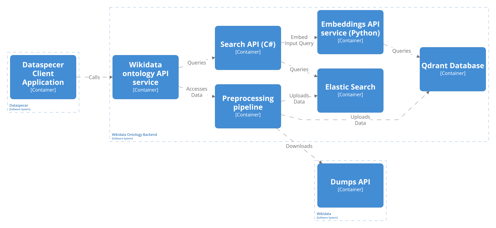
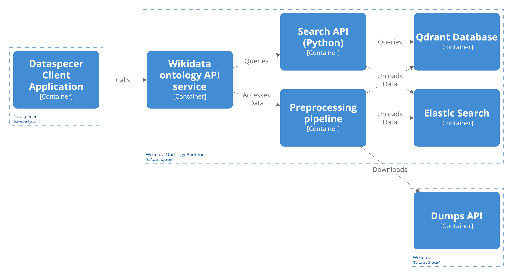

# 8. meeting

This meeting I would like to talk about:
1. Brief overview of what I did.
2. What next?
3. Solutions overview and what to choose. 
    - What solutions?
    - Architecture
4. Testing

## Brief overview of what I did

- Started working on preprocessing.
  - Additional statistics.
  - Property usage "reduction" -> for filtering by properties.
  - Expanding additional lexical information to entities -> for better context and description.
- Meeting with Jakub from Datlowe.

## What next?

- Creating senteces to be vectorized.
- Vectorizing the sentences.
- Choosing what solutions to test.
- Architecture.
- Then implementation.

## Solutions

### Initial ideas

1. query rewriting/expansion using LLM
2. candidate selection
   1. full text search -> bm25, bm25f (it is still sparse vector)
   2. vector -> dense embeddings, sparse learned embeddings
   3. combinations of 1. and 2.
   - **with filtering**
     -  based on selected properties -> "I want classes that have 'these' properties (including from ancestors)"
     -  assign Wikipedia topic to each class, user can filter or it is done implicitely
3. reranking
   - cross-encoder 
   - priority with regard to incoming links (similar to number of instances), sitelinks, external ontology mappings
   - entity linking
     - extract entity mentions from description (user input) map them to wikidata, rerank based on similarity to those entities  
   - Using LLM 

### What I eventually discarded

- **query rewriting/expansion using LLM** (1.)
  - it started to be exceedindly complicated
  - i formely thought it would be easier to implement and evaluate
- filtering in candidate selection **by assigning topic to each class**
  1.  Wikipedia root topics
         - Based on instance from Wikipedia
           - Hard to implement -> slow api, need additional dump 
           - Not everything is mapped to Wikipedia
         - Based on vector similarity to each class
           - not straigt forward with a lot of unknowns
  2.  bertopic & Topic2bert
        - additional model, requires learning the model
        - the topics can be off
  - Another problem was expected long precomputation
- **entity linking**
  - wikidata not very explored -> usually based on mappings to Wikipedia
  - in general focus mainly on matching instances not the concepts
  - the problem is divided into two phases
      1. first locate the mentiones (one language model)
      2. then map the mentions to the entities (second language model) -> usually some embeddings
  - thanks to the structural query
    - we know that it is a mention
    - then we can do the matching, which is itself a search problem    

### What is left to implement

1. Candidate retrieval
   - filtering by properties
     - can be AND (all of the selected) or OR (at least one) -> we can choose based on performance
   - full text
   - emebeddings
2. reranking
   - cross encoder
   - priority to specific features

| Filtering                  | Candidate selection                                                        | Reranking           |
| :------------------------- | :------------------------------------------------------------------------- | :------------------ |
| By provided properties     |   Fulltext bm25 (Elastic)                                                  | Cross Encoder       |
| -                          |   Fulltext bm25f (Elastic)                                                 | features            |
| -                          |   Dense embeedings (Elastic, Qdrant)                                       | combination of both |
| -                          |   Sparse learned embeddings (Qdrant)                                       | -                   |
| -                          |   Sparse learned embeddings (Qdrant) + Dense embeedings(Qdrant, Elastic)   | -                   |
| -                          |   Fulltext bm25 (Elastic) + Dense embeedings(Qdrant, Elastic)              | -                   |
| -                          |   Fulltext bm25f (Elastic) + Dense embeedings(Qdrant, Elastic)             | -                   |

- So it would be:
  - 7 solutions without reranking
  - 7 solutions with cross encoder reranking
  - 7 solution with features reranking
  - 7 solutions with combination of both
  - 28 solutions

- We talked about the tests
  - for each solution test using iterative approach
    - 1. only name
    - 2. add description
    - 3. add properties
  - for each solution test using anything the user wants 
  - that would be 28 + 28 = 56 tests

- I would like to choose only specific solutions
  - maybe test only bm25 and dense embeddings -> can be done in elastic
    - but elastic does not support sparse embeddings (only for subscribers)
  - but qdrant is more performant, but it add additional database to the project

### Architecture

- With C# as API
  - need to embed the things, passing for reranking in crossencoder
  - native paralelism -> but the embeddings still can block

- With Python as API
  - can embed and rerank, no need to pass data
  - but can spawn multiple instances

### Testing

- Should we test searching of properties
- Or should we give them what properties they are looking for.

### Comments

- netestovat uzivatele
- ale dat nam dotazy
- nereflektujeme to hledani
- ale najdeme tridu
- a pak k ni dotazy a ja pak mechanicky otestuju jestli ta trida tam je
  - uzivatel nam vygeneruje dotazy jak by hledal tu tridu
    - pevnost
    - historicke misto ktere hralo roli ve valkach
- problem je ze to kazdy vidi jinak
  - ale muze to udelat blbe protoze tomu odpovidaji jine tridy
  - je to riziko te metody 
  - predtim je ze jsem spokojeny
- mozna kombinace 
  - nejdriv automatizovane a pak tri nejlepsi dat uzivatelum a reranking taky
  - vytipuju nejlepsi kombinace a chci se je seradit -> blbe to je kdyby to bylo 0,1 - 0,2
  - musime zkusit je rozdistribuovat
  - a ti kandidaty muzeme dat na detailnejsi posouzeni
  - podme najit dve tri tridy a pro kazdou z tech trid si pripravit dotazy a pak si ty dotazy pustit
    - a zmerit jak vysoko tu tridu renkovali
    - a zprumerovat pres vsechny tridy
    - a tehle 5 dame pro produkcni posouzeni
    - ale muzou fungovat dobre ale treba blbe vuci uzivatelum
  - a pro ne to pak rucne zevaluovat
